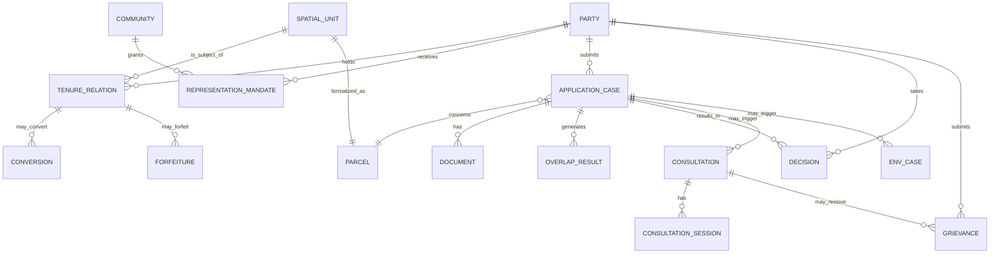

# 08 — Datamodel (LADM, STDM, FFP-LA)

Het datamodel is afgeleid van **ISO 19152 Land Administration Domain Model (LADM, Editie II)**, uitgebreid met **Social Tenure Domain Model (STDM)** voor informele en collectieve rechten, en gepositioneerd binnen de **Fit-for-Purpose Land Administration**-aanpak.

## 8.1 LADM-triplet (kernconcept)

Elke rechtenrelatie wordt vastgelegd als een triplet:

```
        ┌────────────────────┐
        │      LA_Party      │   (wie)
        │   (persoon, groep, │
        │    gemeenschap)    │
        └─────────┬──────────┘
                  │
                  │ heeft
                  ▼
        ┌────────────────────┐
        │      LA_RRR        │   (wat voor recht)
        │  Right / Restric-  │
        │  tion / Responsib. │
        └─────────┬──────────┘
                  │
                  │ op
                  ▼
        ┌────────────────────┐
        │   LA_SpatialUnit   │   (welk stuk grond)
        │ (perceel, dorp,    │
        │  3D-volume)        │
        └────────────────────┘
```

## 8.2 Hoofdentiteiten

### 8.2.1 LA_Party — partij
| Veld | Type | Toelichting |
|---|---|---|
| party_id | UUID | Primary key |
| party_type | enum | `natural_person`, `legal_person`, `community`, `traditional_authority`, `government` |
| name | string | |
| identifiers | json | { national_id, kvk, gemeenschap_code } — **gescheiden opgeslagen voor PII** |
| address_id | UUID | FK |
| represented_by | UUID | FK naar party (vertegenwoordiging) |
| created_at, updated_at | timestamp | |

### 8.2.2 LA_RRR — Rights, Restrictions, Responsibilities
| Veld | Type | Toelichting |
|---|---|---|
| rrr_id | UUID | |
| rrr_type | enum | `ownership`, `lease_erfpacht`, `lease_grondhuur`, `domeingrond_application`, `concession_mining`, `concession_forestry`, `concession_agriculture`, `customary_collective`, `customary_use`, `easement`, `mortgage`, `protected_area_restriction`, `dispute_marker` |
| party_id | UUID | FK |
| spatial_unit_id | UUID | FK |
| source_id | UUID | FK naar brondocument |
| share | numeric | bv. aandeel |
| valid_from, valid_to | date | |
| status | enum | `applied`, `under_review`, `granted`, `registered`, `disputed`, `withdrawn`, `expired` |
| evidence_strength | enum | `formal_title`, `notarial`, `survey`, `customary_proof`, `oral_testimony`, `gps_field`, `none` |
| created_at, updated_at | timestamp | |

### 8.2.3 LA_SpatialUnit — ruimtelijke eenheid
| Veld | Type | Toelichting |
|---|---|---|
| spatial_unit_id | UUID | |
| unit_type | enum | `parcel_2d`, `parcel_3d`, `village_area`, `customary_territory`, `concession_area`, `protected_area`, `infrastructure_corridor` |
| geometry | geometry (PostGIS) | polygoon / multipolygoon / 3D-volume |
| reference_geometry | geometry | gestileerde grens; bij STDM ook ruwe schets |
| label | string | bv. "DEMO_Perceel_023" |
| district | string | |
| area_ha | numeric | berekend |
| precision_class | enum | `survey_cm`, `gps_m`, `sketch`, `satellite_estimate` |
| version | int | |
| valid_from, valid_to | date | |

### 8.2.4 LA_Source — brondocument
| Veld | Type | Toelichting |
|---|---|---|
| source_id | UUID | |
| source_type | enum | `notarial_deed`, `survey_plan`, `application`, `decision`, `objection`, `consultation_minutes`, `photo`, `audio`, `video`, `testimony`, `historical_map`, `gps_track`, `other` |
| filename | string | |
| storage_uri | string | |
| hash_sha256 | string | onveranderlijk identificatie |
| created_by, created_at | | |
| classification | enum | `public`, `internal`, `confidential`, `fpic_restricted` |

### 8.2.5 SP_PlanUnit — ruimtelijk plan
| Veld | Type | Toelichting |
|---|---|---|
| plan_id | UUID | |
| plan_type | enum | `national`, `regional`, `district`, `local`, `protected_designation` |
| geometry | geometry | |
| restrictions | text | |
| valid_from, valid_to | date | |

### 8.2.6 VM_ValuationUnit — waardering (later)
Genoemd in LADM Editie II; voor SGDP-roadmap. Niet in demo.

## 8.3 STDM-uitbreiding (informele/collectieve rechten)

Voor ITP-context volstaat LADM alleen niet. STDM voegt toe:

### 8.3.1 ST_SocialTenureRelation
| Veld | Type | Toelichting |
|---|---|---|
| str_id | UUID | |
| party_id | UUID | gemeenschap of huishouden |
| spatial_unit_id | UUID | |
| tenure_type | enum | `customary_residence`, `hunting_ground`, `fishing_ground`, `agriculture`, `cultural_sacred`, `burial`, `pasture` |
| evidence_set | json | lijst van source_id's: foto, audio, getuigenis |
| recognized_by | json | bv. ["VIDS", "kapitein_naam_X"] |
| seasonality | string | optioneel, bv. "regenseizoen" |

### 8.3.2 ST_Community
| Veld | Type | Toelichting |
|---|---|---|
| community_id | UUID | |
| name | string | |
| people_group | enum | `inheems`, `tribaal_marron`, `gemengd` |
| traditional_authority | json | { granman, kapiteins[], basjas[] } |
| primary_language | string | |
| population_estimate | int | |

## 8.4 FPIC-gegevensmodel

### 8.4.1 FPIC_Process
| Veld | Type | Toelichting |
|---|---|---|
| fpic_id | UUID | |
| community_id | UUID | FK |
| spatial_unit_id | UUID | FK |
| trigger_rrr_id | UUID | FK — welk recht/aanvraag triggert FPIC |
| status | enum | zie [02-werkgroep-werkwijze.md §2.4.3](02-werkgroep-werkwijze.md#243-fpic-statussen-in-het-platform) |
| started_at, last_event_at | timestamp | |
| outcome | enum | `consent`, `conditional`, `objection`, `withdrawn`, `pending` |
| outcome_recorded_by | UUID | party_id (gezagsfiguur) |

### 8.4.2 FPIC_Event
| Veld | Type | Toelichting |
|---|---|---|
| event_id | UUID | |
| fpic_id | UUID | FK |
| event_type | enum | `info_provided`, `meeting`, `feedback_received`, `objection_filed`, `condition_added`, `consent_given`, `consent_withdrawn` |
| date, location | | |
| attendees | json | lijst party_id's |
| evidence_set | json | source_id's |
| notes | text | |

## 8.5 Werkgroep- en werkprocesentiteiten

### 8.5.1 Case (dossier)
| Veld | Type |
|---|---|
| case_id | UUID |
| case_number | string (zaaknummer) |
| case_type | enum (`domeingrond_application`, `concession_review`, `boundary_demarcation`, `dispute`, `policy_review`) |
| primary_spatial_unit_id | UUID |
| primary_party_id | UUID |
| status | enum (zie FR-2.3) |
| risk_score | enum (`low`, `medium`, `high`) |
| assigned_to | user_id |
| created_at | timestamp |

### 8.5.2 Decision (besluit)
| Veld | Type |
|---|---|
| decision_id | UUID |
| working_group_meeting_id | UUID |
| title | string |
| outcome | text |
| vote_for, vote_against, abstain | int |
| minority_view | text (optioneel) |
| linked_case_ids | json |

### 8.5.3 ActionItem (actiepunt)
| Veld | Type |
|---|---|
| action_id | UUID |
| description | text |
| owner_user_id | UUID |
| due_date | date |
| status | enum (`open`, `in_progress`, `done`, `overdue`, `cancelled`) |
| linked_meeting_id | UUID |

### 8.5.4 Meeting (vergadering)
| Veld | Type |
|---|---|
| meeting_id | UUID |
| meeting_type | enum (`plenary`, `workstream`, `klankbord`, `field_consult`, `executive`) |
| date, location | |
| attendees, absent | json |
| agenda | json |
| minutes_uri | string |

### 8.5.5 AuditLog
| Veld | Type |
|---|---|
| audit_id | bigint serial |
| timestamp | timestamp |
| user_id | UUID |
| action | enum (`create`, `update`, `delete`, `view`, `export`, `login`) |
| entity_type, entity_id | string, UUID |
| old_value_json, new_value_json | json |
| ip_address, user_agent | string |

Append-only tabel; aparte storage; periodiek hash-chaining.

## 8.6 Relatieschema (vereenvoudigd)

```
ST_Community ─┐
              │
              ▼
LA_Party ──► LA_RRR ──► LA_SpatialUnit ◄── SP_PlanUnit
              │                ▲
              │                │
              ▼                │
          LA_Source ───────────┘
              │
              ▼
       ST_SocialTenureRelation
              │
              ▼
        FPIC_Process ──► FPIC_Event
              │
              ▼
            Case ──► Decision
                 └──► ActionItem
                 └──► AuditLog (op alle entiteiten)
```

### 8.6.1 erDiagram (Mermaid)



## 8.7 Aanvullende entiteiten (Surinaamse context)

### 8.7.1 `representation_mandate`
| Veld | Toelichting |
|---|---|
| mandate_id | UUID |
| community_id | FK naar `community` |
| representative_party_id | FK naar `party` |
| start_date, end_date | Mandaatperiode |
| source_document_id | FK naar bewijs (bv. dorpsbrief, FPIC-akkoord) |

Apart vastgelegd zodat **legitimiteit van vertegenwoordiging** verifieerbaar is — een vereiste van FAO FPIC Toolkit.

### 8.7.2 `application_case`
| Veld | Toelichting |
|---|---|
| case_id | UUID |
| case_number | Zaaknummer |
| case_type | enum (`domeingrond_application`, `concession_review`, `boundary_demarcation`, `dispute`, `policy_review`, `tenure_renewal`, `tenure_conversion`, `forfeiture`) |
| submitted_by_party_id | FK |
| parcel_id | FK |
| purpose_type | enum |
| status | enum |
| risk_score | int (0–100) — zie [10-adviesmotor.md §10.4](10-adviesmotor.md) |
| legal_regime | json — versie van decreet, GLIS-besluit, privacy, WRO, collectieve rechten |

### 8.7.3 `overlap_result`
| Veld | Toelichting |
|---|---|
| overlap_id | UUID |
| case_id | FK |
| spatial_unit_id | FK (object waarmee overlap is) |
| constraint_type | enum (`existing_right`, `pending_application`, `concession`, `customary_territory`, `protected_area`, `contaminated_site`, `wro_zoning`) |
| overlap_pct | numeric |
| severity | enum (`info`, `warning`, `blocker`) |
| explanation | text — uitleg per regel |

### 8.7.4 `audit_event` (formeel schema)
| Veld | Toelichting |
|---|---|
| audit_id | bigint serial |
| timestamp | timestamp |
| user_id | UUID |
| action | enum (`create`, `update`, `delete`, `view`, `export`, `login`) |
| entity_name, entity_id | string, UUID |
| old_value, new_value | json |
| ip_address, user_agent | string |
| hash_chain_prev | string — voor periodieke hash-chaining |

### 8.7.5 Milieu-entiteiten
Zie [17-milieu-nma.md §17.4](17-milieu-nma.md#174-datamodel-uitbreidingen): `EnvCase`, `EnvPermit`, `ContaminatedSite`, `RehabPlan`.

### 8.7.6 Grondhuur-/conversie-/vervallenverklaring-entiteiten
Zie [18-grondhuur-conversie.md](18-grondhuur-conversie.md): `tenure_relation` met levenscyclus, `conversion`, `forfeiture`, `compensation_case`.

## 8.7 Waarom deze keuzes

- **LADM** geeft internationale standaardisatie en SDG-rapportage (incl. indicator 1.4.2).
- **STDM** voorkomt dat ITP-rechten worden geforceerd in een formele eigendoms-mal.
- **FFP-LA** legitimeert dat we starten met "voldoende nauwkeurig" en niet wachten op cm-precisie.
- **Versionering + audit log** is de fundering tegen corruptie en voor IACHR-bestendigheid.
- **Aparte FPIC-tabellen** maken FPIC een eersterangs object, niet een notitieveld.
